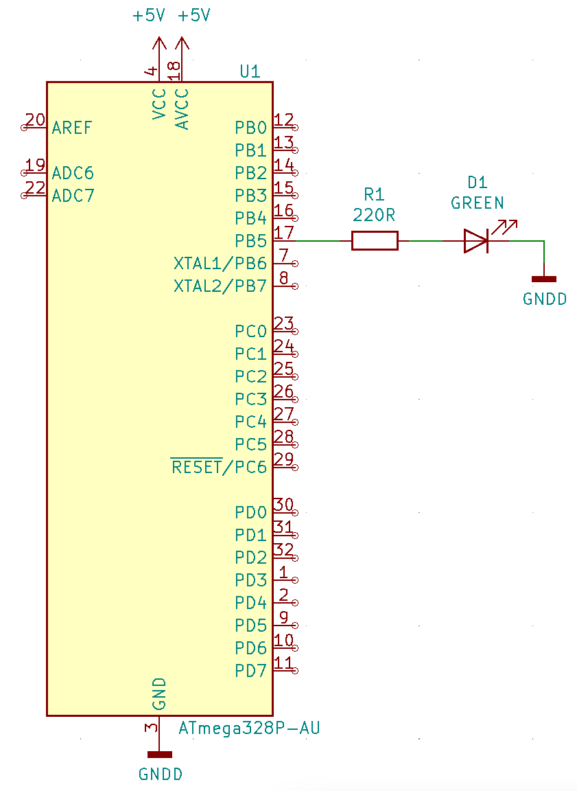

# Lab 1: Pavel Vaněk

Link to my `Digital-electronics-2` GitHub repository:

   [https://github.com/Bobik77/Digital-electronics-2](https://github.com/Bobik77/Digital-electronics-2)


### Blink example

1. What is the meaning of the following binary operators in C?
   * `|`  Operátor log. součtu (OR)
   * `&`  Operátor log. součinu (AND)
   * `^`  Operátor log. výlučného součtu (XOR)
   * `~`  Operátor log. negace (NOT)
   * `<<` Operátor bitového posunu vlevo (left shift)
   * `>>`Operátor bitového posunu vpravo (right shift)

2. Complete truth table with operators: `|`, `&`, `^`, `~`

| **b** | **a** |**b or a** | **b and a** | **b xor a** | **not b** |
| :-: | :-: | :-: | :-: | :-: | :-: |
| 0 | 0 | 0 | 0 | 0 | 1 |
| 0 | 1 | 1 | 0 | 1| 1 |
| 1 | 0 | 1 | 0 | 1 | 0 |
| 1 | 1 | 1 | 1 | 0 | 0 |


### Morse code

1. Listing of C code with syntax highlighting which send "HELLO" message via LED

```c
// morse marks durations in ms
#define dit 100         // . change speed here
#define dash 3*dit     // -
#define gap_length dit  // gap between marks
#define short_space_length 3*dit // between letters
#define long_space_length 5*dit // between words

/* Function definitions ----------------------------------------------*/
/**********************************************************************
 * Purpose: Delay defined time in ms
 **********************************************************************/
void my_delay_ms(int n)
{
	while(n--) {
		_delay_ms(1);
	}
}

/**********************************************************************
 * Purpose:  Send dit or dash mark
 **********************************************************************/
void send_mark(int mark_length)
{   //mark_lenght in ms

	DDRB = DDRB | (1<<LED_GREEN);	//turn on LED
	my_delay_ms(mark_length);		//mark delay
	PORTB = PORTB & ~(1<<LED_GREEN);//turn off LED
	my_delay_ms(gap_length);		//gap between marks
}

/**********************************************************************
 * Function: Main function where the program execution begins
 * Purpose:  Sending hello message in loop in morse code via LED
 * Returns:  none
 **********************************************************************/
int main(void)
{
    // Set pin as output in Data Direction Register
    // DDRB = DDRB or 0010 0000
    DDRB = DDRB | (1<<LED_GREEN);

    // Set pin LOW in Data Register (LED off)
    // PORTB = PORTB and 1101 1111
    PORTB = PORTB & ~(1<<LED_GREEN);

    // Infinite loop
    while (1)
    {   //H
        send_mark(dit);
        send_mark(dit);
        send_mark(dit);
        send_mark(dit);
        _delay_ms(short_space_length);
        //E
        send_mark(dit);
        _delay_ms(short_space_length);
        //L
        send_mark(dit);
        send_mark(dash);
        send_mark(dit);
        send_mark(dit);
        _delay_ms(short_space_length);
        //L
        send_mark(dit);
        send_mark(dash);
        send_mark(dit);
        send_mark(dit);
        _delay_ms(short_space_length);
        //O
        send_mark(dash);
        send_mark(dash);
        send_mark(dash);
        _delay_ms(short_space_length);
        //W
        send_mark(dit);
        send_mark(dash);
        send_mark(dash);
        _delay_ms(long_space_length);
    }

    // Will never reach this
    return 0;
}


```


2. Scheme of Morse code application, i.e. connection of AVR device, LED, resistor, and supply voltage. The image can be drawn on a computer or by hand. Always name all components and their values!

   