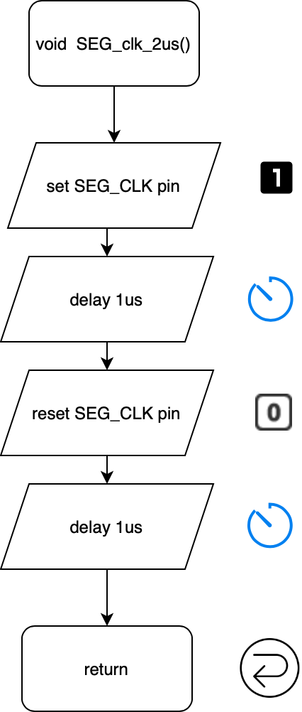
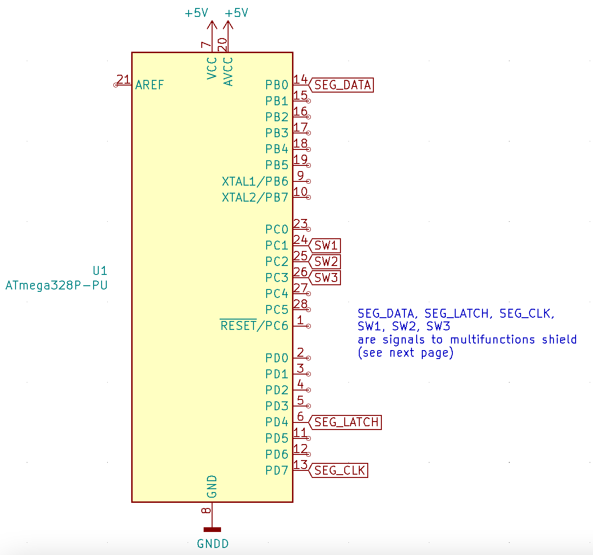
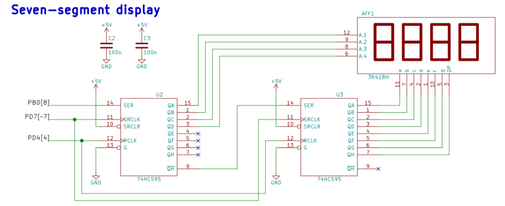
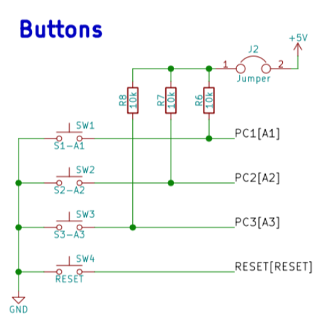

# Lab 5: Pavel Vaněk

Link to my `Digital-electronics-2` GitHub repository:

   [https://github.com/Bobik77/Digital-electronics-2](https://github.com/Bobik77/Digital-electronics-2)


### 7-segment library

1. In your words, describe the difference between Common Cathode and Common Anode 7-segment display.
   * CC SSD - Všechny katody segmentů jsou spojené, segmenty tedy řídíme skrze jednotlivé anody (HIGH - active)
   * CA SSD - Všechny anody segmentů jsou spojené, segmenty tedy řídíme skrze jednotlivé katody (LOW - active)

2. Code listing with syntax highlighting of two interrupt service routines (`TIMER0_OVF_vect`, `TIMER0_OVF_vect`) from counter application with at least two digits, ie. values from 00 to 59:

```c
/**********************************************************************
 * Function: Timer/Counter1 overflow interrupt
 * Purpose:  Increment counter value from 00 to 59.
 **********************************************************************/
uint8_t digit1 = 0; // showed number on 1st dig.
uint8_t digit2 = 0; // showed number on 2nd dig.
ISR(TIMER1_OVF_vect){ // slower timer - counting 00-59
    digit1++; // increment 1st dig.
    if (digit1 == 10){ // 1st dig. overflow
        digit1 = 0; // reset 1st dig
        digit2++;   // increment 2nd dig.
        if (digit2 == 6) digit2 = 0; //reset 2nd dig.
    }
}
```

```c
/**********************************************************************
 * Function: Timer/Counter0 overflow interrupt
 * Purpose:  Display tens and units of a counter at SSD.
 **********************************************************************/
ISR(TIMER0_OVF_vect){ // faster timer - disp. refresh
    static uint8_t position = 0;
    // refresh 1st digit
    if (position == 0){ SEG_update_shift_regs(digit1,0;
    } // refresh 2nd digit
    else{ SEG_update_shift_regs(digit2,1); 
    }

    position++; // increment refreshed dig. position
    if (position > 1) position = 0; // reset dig. position at the end
}
```

3. Flowchart figure for function `SEG_clk_2us()` which generates one clock period on `SEG_CLK` pin with a duration of 2&nbsp;us. The image can be drawn on a computer or by hand. Use clear descriptions of the individual steps of the algorithms.

   


### Kitchen alarm

Consider a kitchen alarm with a 7-segment display, one LED and three push buttons: start, +1 minute, -1 minute. Use the +1/-1 minute buttons to increment/decrement the timer value. After pressing the Start button, the countdown starts. The countdown value is shown on the display in the form of mm.ss (minutes.seconds). At the end of the countdown, the LED will start blinking.

1. Scheme of kitchen alarm; do not forget the supply voltage. The image can be drawn on a computer or by hand. Always name all components and their values.

   
   
   
