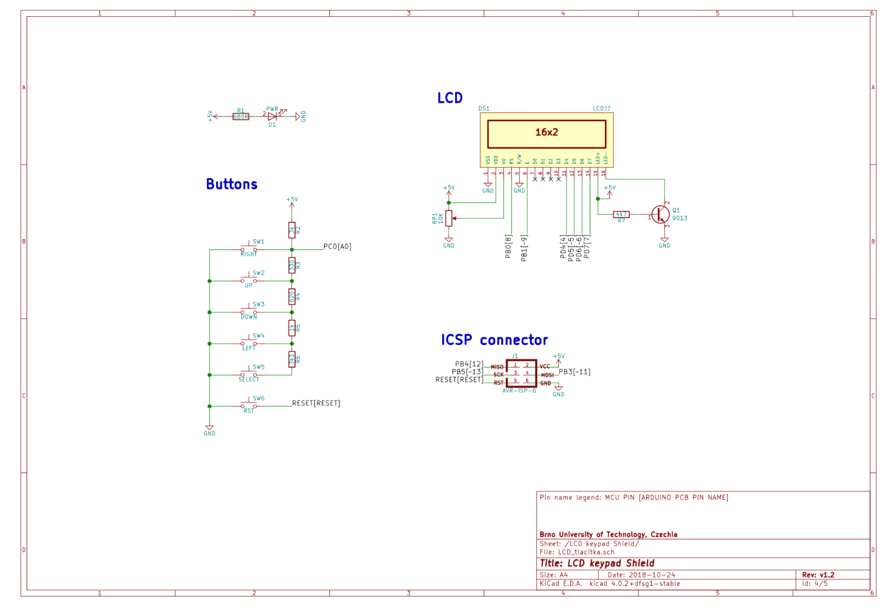

# Lab 7: Pavel Vaněk

Link to my `Digital-electronics-2` GitHub repository:

   [https://github.com/Bobik77/Digital-electronics-2](https://github.com/Bobik77/Digital-electronics-2)


### Analog-to-Digital Conversion

1. Complete table with voltage divider, calculated, and measured ADC values for all five push buttons.

   | **Push button** | **PC0[A0] voltage** | **ADC value (calculated)** | **ADC value (measured)** |
   | :-: | :-: | :-: | :-: |
   | Right  | 0&nbsp;V | 0   | 0 |
   | Up     | 0.495&nbsp;V | 101 | 99 |
   | Down   |   1.203 V    | 246 | 257 |
   | Left   |   1.969 V    | 403 | 409 |
   | Select |    3.18 V  |  651   | 639 |
   | none   |   5 V    |   1023  | 1023  |

2. Code listing of ACD interrupt service routine for sending data to the LCD/UART and identification of the pressed button. Always use syntax highlighting and meaningful comments:

```c
/* Constants ----------------------------------------------------------*/
//array of strings key names
const char *key_name_str[6] = { "NONE", "SELECT", "LEFT",
                              "DOWN","UP","RIGHT"};

```

```c
/**********************************************************************
 * Function: ADC complete interrupt
 * Purpose:  Display value on LCD and send it to UART.
 **********************************************************************/
ISR(ADC_vect)
{
    //clear first line
    lcd_gotoxy(8,0); //set cursor
    lcd_puts("        "); 

    // read adc value
    uint16_t ADC_val = ADC;
    
    char lcd_string[4] = "    ";      // String for converting numbers by itoa()
    //show in DEC
    itoa(ADC_val, lcd_string, 10);     // Convert to str
    lcd_gotoxy(8,0); //set cursor to A
    lcd_puts(lcd_string); 
    // show in HEX
    itoa(ADC_val, lcd_string, 16);     // Convert to str
    lcd_gotoxy(13,0); //set cursor to B
    lcd_puts(lcd_string);
    
    // Show addicted key-label
    uint8_t key = 0;
    if (ADC_val > 1020) key = 0; //NON
    else if (ADC_val > 600) key = 1; //SEL
    else if (ADC_val > 390) key = 2; //LEFT
    else if (ADC_val > 200) key = 3; //DWN
    else if (ADC_val > 50)  key = 4; //UP
    else key = 5; //RIGHT
    lcd_gotoxy(8,1); //set cursor to C
    lcd_puts("        "); //clear 2nd line disp
    lcd_gotoxy(8,1); //set cursor to C
    lcd_puts(key_name_str[key]); //show on LCD
    uart_puts(key_name_str[key]);//send via COM
    uart_puts("\n"); //line feed
}
```


### UART communication

1. (Hand-drawn) picture of UART signal when transmitting three character data `De2` in 4800 7O2 mode (7 data bits, odd parity, 2 stop bits, 4800&nbsp;Bd).

   

2. Flowchart figure for function `uint8_t get_parity(uint8_t data, uint8_t type)` which calculates a parity bit of input 8-bit `data` according to parameter `type`. The image can be drawn on a computer or by hand. Use clear descriptions of the individual steps of the algorithms.

   

### Temperature meter

Consider an application for temperature measurement and display. Use temperature sensor [TC1046](http://ww1.microchip.com/downloads/en/DeviceDoc/21496C.pdf), LCD, one LED and a push button. After pressing the button, the temperature is measured, its value is displayed on the LCD and data is sent to the UART. When the temperature is too high, the LED will start blinking.

1. Scheme of temperature meter. The image can be drawn on a computer or by hand. Always name all components and their values.

   
   